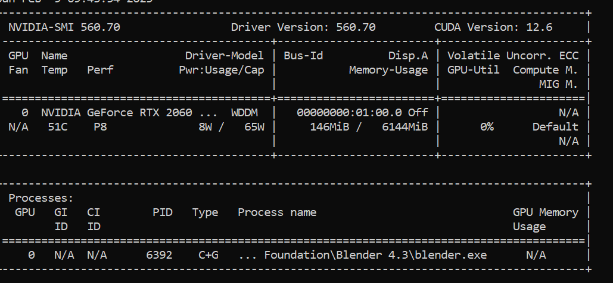

# IkimTechCo Landing Page Redesign

This project is a complete redesign of the [IkimTechCo](https://www.ikimtechco.com/) landing page. The redesign focuses on clean, modern aesthetics using **React.js** and follows the **Swiss/International Typographic Style** principles for a minimalist, grid-based layout that prioritizes clarity, structure, and visual hierarchy.





## 🧠 Project Overview

- **Tech Stack:** React.js, CSS Modules / Tailwind CSS (optional), Vite / Create React App
- **Design Principle:** Swiss / International Typographic Style
- **Brand Color:** `#033D54` (Deep Teal)

## 🎨 Design Philosophy

The redesign emphasizes:
- Grid-based structure
- Asymmetrical layouts
- Sans-serif typography
- Bold use of whitespace
- Minimal ornamentation
- Strict alignment and visual rhythm

## 🚀 Features

- Responsive design across devices
- Smooth scroll and basic animations
- Optimized performance using modern React practices
- Accessible, semantic HTML and contrast-aware color usage
- Custom reusable components for scalability

## 📁 Project Structure

src/
├── components/
│ ├── sections/
│ │ ├── Hero.tsx
│ │ ├── About.tsx
│ │ ├── Services.tsx
│ │ ├── Work.tsx
│ │ ├── Team.tsx
│ │ ├── Contact.tsx
│ │ └── WhyChooseUs.tsx
│ ├── common/
│ │ ├── Button.tsx
│ │ ├── ScrollAnimation.tsx
│ │ ├── ParallaxElement.tsx
│ ├── App.tsx
├── styles/
│ ├── global.css
│ ├── components.css
│ └── sections.css
├── types/
│ ├── sections.d.ts
├── utils/
│ ├── animations.ts
│ ├── constants.ts
│ └── helpers.ts
├── public/
│ ├── favicon.ico
│ ├── main.jpg
│ ├── video-editing.jpg
│ ├── mobile.jpg
│ ├── 3d.jpg
│ └── userpic.jpg
├── .gitignore
├── package.json
├── tsconfig.json
└── README.md

## 📦 Installation

1. Clone the repository:
   ```bash
   git clone https://github.com/yourusername/ikim-tech.git
   cd ikim-tech
   ```

2. Install dependencies:
   ```bash
   npm install
   ```

3. Start the development server:
   ```bash
   npm run dev
   ```

